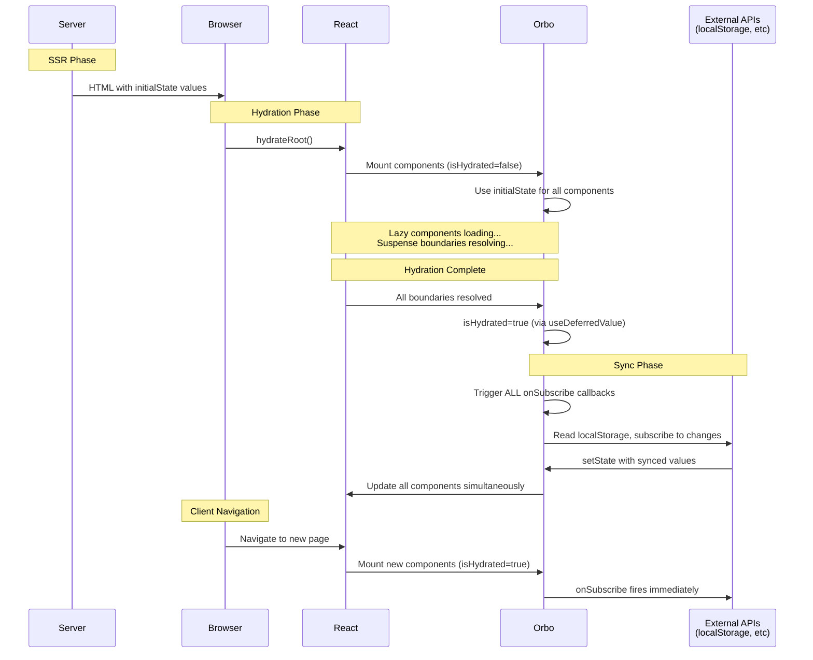

# Orbo

[](https://www.npmjs.com/package/orbo) [](https://bundlephobia.com/result?p=orbo)


Minimal, lazy-initialized global state for React. Zero nested providers, true bundle splitting, useState-familiar API

## Why Orbo?

React applications inevitably accumulate global state: dark mode, user preferences, feature flags, A/B tests. The traditional solution creates a maintenance nightmare of nested Context providers:

```tsx
<DomainProvider>
  <FeaturesProvider>
    <PreferencesProvider>
      <CartProvider>
        <ModalProvider>
          <YourApp />
```

Every new feature adds another provider, every page loads all state logic regardless of usage, and your `_app.tsx` becomes a dumping ground for cross-team dependencies

Orbo takes a different approach: **What if global state was as easy as useState, automatically lazy initialized, and completely decoupled from your app shell?**

Built from the ground up for modern React applications that demand both performance and developer experience. ~340 lines of readable TypeScript source, minified to just 1KB. Zero dependencies. TypeScript-first

> [!WARNING]
> Orbo is designed specifically for **singleton global states** (dark mode, user preferences, feature flags, ...) -> It is **not a full state management solution** like Redux or Zustand

## Features

- 🚫 **Zero nested providers** - Single `GlobalStateProvider` replaces all provider nesting
- 📦 **True bundle splitting** - State code loads only when components that use it render
- ⚡ **useState-familiar API** - `const count = useCount()` and `setCount(5)` - that's it
- 🔒 **SSR safe** - No hydration mismatches, no useEffect hacks
- 🎯 **TypeScript first** - Compile-time safety with module augmentation
- 🪶 **Minimal** - 1KB minified, zero dependencies, tree-shakeable

## Installation

```bash
npm install orbo
```

## Quick Start

```tsx
import { createGlobalState, GlobalStateProvider } from "orbo";

// State definition stays with your component - not in _app.tsx
const [useCount, useSetCount] = createGlobalState({
  initialState: () => 0,
});

function Counter() {
  const count = useCount();
  const setCount = useSetCount();

  return <button onClick={() => setCount(count + 1)}>Count: {count}</button>;
}

function App() {
  return (
    <GlobalStateProvider initialValues={{}}>
      <Counter />
    </GlobalStateProvider>
  );
}
```

That's it. No provider nesting, no complex setup, no `_app.tsx` modifications.

## Real-World Examples

### Simple Dark Mode

Here's how you'd handle a typical dark mode implementation:

```tsx
// useDarkMode.ts - lives with your component, not in _app.tsx
import { createGlobalState } from "orbo";

const [useDarkMode, useSetDarkMode] = createGlobalState({
  initialState: ({ cookies }) => cookies.darkMode === "true",
});

export { useDarkMode, useSetDarkMode };

// ⏱️ For SSR apps with localStorage sync:
const [useDarkMode, useSetDarkMode] = createGlobalState({
  initialState: () => false,  // ← Used during SSR & hydration (avoids mismatch)
  onSubscribe: (setState) => { // ← Fires AFTER all components hydrate
    // Safe to read localStorage here - hydration is complete
    setState(localStorage.getItem('darkMode') === 'true');

    // Optional: sync across browser tabs
    const handleStorageChange = (e: StorageEvent) => {
      if (e.key === 'darkMode') setState(e.newValue === 'true');
    };
    window.addEventListener('storage', handleStorageChange);
    return () => window.removeEventListener('storage', handleStorageChange);
  }
});

// DarkModeToggle.tsx
import { useDarkMode, useSetDarkMode } from "./useDarkMode";

export function DarkModeToggle() {
  const isDark = useDarkMode();
  const setDarkMode = useSetDarkMode();

  return (
    <button onClick={() => setDarkMode(!isDark)}>{isDark ? "🌙" : "☀️"}</button>
  );
}

// _app.tsx - clean and minimal
function App({ pageProps, cookies }) {
  return (
    <GlobalStateProvider initialValues={{ cookies }}>
      <Component {...pageProps} />
    </GlobalStateProvider>
  );
}
```

### Server Time with Auto-Update

Here's a more complex example showing lifecycle management with `onSubscribe` and `persistState`:

```tsx
// useServerTime.ts
import { createGlobalState } from "orbo";

const [useServerTime, useSetServerTime] = createGlobalState({
  initialState: ({ serverTime }) => new Date(serverTime),
  onSubscribe: (setState) => {
    // Start timer when first component subscribes
    const interval = setInterval(() => {
      setState(new Date());
    }, 1000);

    // Return cleanup function
    return () => {
      clearInterval(interval);
    };
  },
  // Cleanup timer when no components are using this state
  persistState: false,
});

export { useServerTime };

// Clock.tsx
import { useServerTime } from "./useServerTime";

export function Clock() {
  const time = useServerTime();

  return <div>Current time: {time.toLocaleTimeString()}</div>;
}

// _app.tsx
function App({ pageProps }) {
  return (
    <GlobalStateProvider initialValues={{ serverTime: Date.now() }}>
      <Component {...pageProps} />
    </GlobalStateProvider>
  );
}
```

In these examples, the logic is completely decoupled from your app shell. Components that don't use the state never load its code. New developers can understand and modify features without touching `_app.tsx`

## TypeScript Support

Orbo provides compile-time safety through module augmentation (same pattern as styled-components):

```typescript
// types.ts
// Import to enable module augmentation
import "orbo";
declare module "orbo" {
  interface GlobalStateInitialValues {
    cookies: { darkMode?: string };
    user: { id: string; name: string } | null;
    hostname: string;
  }
}

// Now your initialState functions are fully typed
const [useUser] = createGlobalState({
  initialState: (initialValues) => {
    // initialValues.user <- TypeScript knows this exists and its shape
    // initialValues.invalidProp <- TypeScript error!
    return initialValues.user;
  },
});
```

## Architecture

Orbo's design is based on three key insights:

1. **Lazy Initialization**: State code should only be initialized when the components that use it actually render
2. **Decoupling**: State definitions should live with components, not in central configuration files
3. **Explicit Contracts**: Dependencies should be compile-time safe, not runtime discoveries

This results in:

- Better performance through **automatic code splitting**
- Better maintainability through **colocation**
- Better reliability through **TypeScript contracts**

## SSR & Hydration Strategy

Orbo's hydration strategy ensures zero hydration mismatches when working with client-only APIs like localStorage, even with React 19's selective hydration and Suspense boundaries.

### The Challenge

When server-rendering with client-side state (dark mode from localStorage, user preferences, etc.), you face a fundamental conflict:
- Server doesn't have access to localStorage → renders with default state
- Client needs to read localStorage → but doing so during hydration causes mismatches

Traditional solutions use `useEffect` hacks that cause flashing or double renders. Orbo solves this with a two-phase initialization strategy.

### How It Works

Orbo uses React's [effect timing](https://react.dev/learn/synchronizing-with-effects) and [deferred values](https://react.dev/reference/react/useDeferredValue) to coordinate when external state syncs happen. Here's the flow:



### Key Phases

1. **SSR Phase**: Server renders with `initialState` values (no localStorage access)
2. **Hydration Phase**: Client mounts components using same `initialState` (matches server HTML perfectly)
3. **Suspense Resolution**: React waits for all lazy-loaded components to hydrate
4. **Sync Phase**: After complete hydration, `onSubscribe` callbacks fire simultaneously across all components
5. **Client Navigation**: On subsequent navigations, `onSubscribe` fires immediately (no hydration needed)

This approach guarantees:
- ✅ Zero hydration mismatches (server and client render identically)
- ✅ No double renders (state updates happen in a single batch after hydration)
- ✅ Consistent state (all components sync simultaneously, never partially)
- ✅ Works with Suspense (waits for lazy components via `useDeferredValue`)

## API Reference

### `createGlobalState<T>(config)`

Creates a pair of hooks for reading and writing global state.

```tsx
const [useValue, useSetValue] = createGlobalState({
  initialState: (initialValues, isHydrated) => computeInitialValue(initialValues, isHydrated),

  // Optional: sync with external sources (client-side only)
  onSubscribe: (setState, currentState) => {
    // Subscribe to external changes
    // Optional: return cleanup function
    return () => {
      // Cleanup when last component unsubscribes
    };
  },

  // Optional: keep state in memory when components unmount
  persistState: true, // (default)
});
```

**Parameters:**

- `config.initialState`: Function that receives initial values and `isHydrated` flag, returns the initial state
- `config.onSubscribe` _(optional)_: Function called when first component subscribes (client-side only). Receives `setState` and `currentState`. Can return a cleanup function which runs when the last component unsubscribes
- `config.persistState` _(optional)_: When `true`, keeps state in memory after components unmount (default: `true`)

#### Handling Client-Only Values with `isHydrated`

When working with client-only APIs like `localStorage`, `sessionStorage`, or browser APIs that aren't available during server-side rendering, there is the `isHydrated` parameter to optimize initial state handling

In general it is best practices **NOT to mix SSR with client-only state** as doing so creates hydrarion mismatches issues

Use the `isHydrated` flag only as a last resort when you absolutely must read from client-only APIs:

```tsx
const [useTheme] = createGlobalState({
  initialState: (initialValues, isHydrated) => {
    if (!isHydrated) {
      // During SSR and initial hydration: use server value to avoid mismatch
      return 'light';
    }
    // After hydration: safe to use client-only APIs
    return localStorage.getItem('theme') || 'light';
  }
});
```

**Returns:**

- `[useGlobalState, useSetGlobalState]` - React hooks for reading and writing the state

### `GlobalStateProvider`

Root provider that manages state isolation and provides initial values

```tsx
<GlobalStateProvider initialValues={{ cookies, user }}>
  {children}
</GlobalStateProvider>
```

**Props:**

- `initialValues`: Object containing initial values passed to `initialState` functions
- `children`: React children

## Examples

Check out the [examples directory](https://github.com/DigitecGalaxus/orbo/tree/main/examples) for complete implementations:

- **[base](https://github.com/DigitecGalaxus/orbo/tree/main/examples/base)** - Counter and timer examples showing basic state management and cleanup with `onSubscribe`
- **[suspense](https://github.com/DigitecGalaxus/orbo/tree/main/examples/suspense)** - Dark mode with SSR, Suspense boundaries, and localStorage sync - demonstrates the complete hydration strategy described above with zero hydration mismatches

## License

[MIT](LICENSE)
